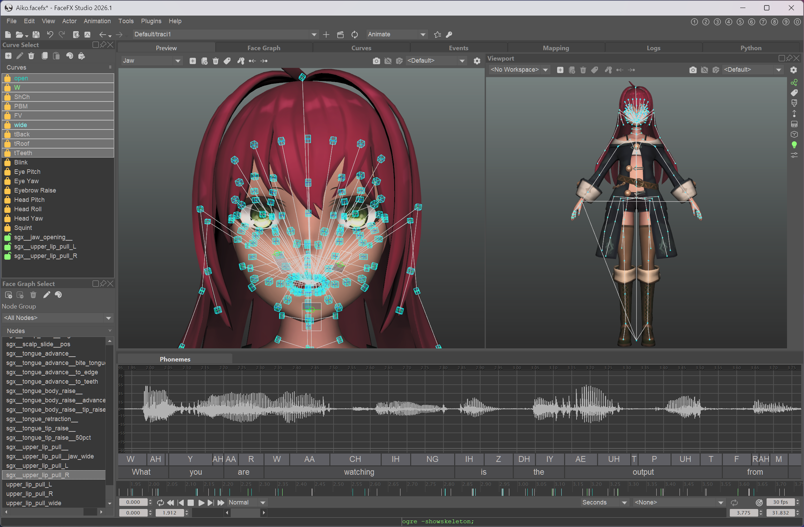
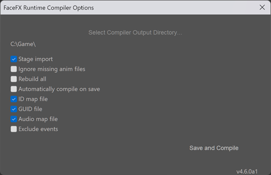

Requirements and Key Concepts
=============================

Requirements
------------

+ [FaceFX Unlimited](https://www.speech-graphics.com/facefx) 2026+ or [SGX Production Tools](https://www.speech-graphics.com/sgx-production-audio-to-face-animation-software) 4.6+ are required to generate animations. These tools require Windows, but the data created by the SGX|FaceFX Runtime compiler is usable on any platform.

+ The [SGX\|FaceFX Runtime](https://www.speech-graphics.com/sgx-runtime) compiler (or plugin for FaceFX Studio) is required to process content prior to being imported into Unreal Engine 5.

+ [Unreal Engine 5](https://www.unrealengine.com)

+ The FaceFX UE5 Plugin, which is available in a [pre-compiled binary distribution](https://unreal.facefx.com) or in [source code](https://www.github.com/FaceFX/UE5) form.

Key Concepts
------------

### Software Components

There are four main software components that make up the full FaceFX UE5 Plugin workflow:

+ [FaceFX Unlimited](https://www.speech-graphics.com/facefx) or [SGX Production Tools](https://www.speech-graphics.com/sgx-production-audio-to-face-animation-software)

+ [SGX\|FaceFX Runtime](https://www.speech-graphics.com/sgx-runtime)

+ The Runtime plugin for FaceFX Studio

+ [The FaceFX UE5 Plugin](https://unreal.facefx.com) itself

#### FaceFX Unlimited

FaceFX Studio is the application you use to define your character's facial setup and generate animations from audio files. You can also hand animate facial animations, either from scratch or on top of the generated animations. FaceFX Studio works with **.facefx** files that contain your character's facial setup and animations.

#### SGX Production Tools

SGX Studio, SGX Director, and SGX Producer are used to define your character's facial setup and generate animations from audio files. SGX Production Tools work with **.k** and **.event** files that define your character's facial setup and animations, respectively.

#### SGX|FaceFX Runtime

The Runtime is the component that runs inside the game engine and plays back and manages the data you create in FaceFX Studio or SGX Production Tools. The Runtime contains a data compiler that transforms the source files into data that can be loaded and used by the Runtime. The Runtime is used by the FaceFX UE5 Plugin.

If you are a programmer and wish to know more about the Runtime itself, you can find a detailed Programmer's Manual at **facefx/doc/pdf/manual.pdf** and an API Reference Guide at **facefx/doc/html/index.html**.

#### The Runtime plugin for FaceFX Studio

The Runtime plugin for FaceFX Studio provides an interface for using the Runtime data compiler from inside of FaceFX Studio.

To use the Runtime plugin for FaceFX Studio with the FaceFX UE5 Plugin, leave the compiler output directory as the default setting and make sure the following options are always **checked**:

+ Stage import
+ ID map file
+ Audio map file

##### The **.ffxc** folder

When you compile your actor with the Runtime compiler (and specify `--stage-import`), an **<actorname>.ffxc** folder is created in the same folder as your **.facefx** file. This is what is imported when you drag your **.facefx** file onto the Unreal Engine 5 Content Browser. It contains all of the assets that have changed and need to be re-imported.

The **.ffxc** folder is required for the FaceFX UE5 Plugin to properly import FaceFX data, so always be sure to specify the `--stage-import` option when running the compiler.

Do not touch the **.ffxc** folder yourself.

##### Minimal Rebuild

When you have a lot of animations, compiling all of them can take a long time. Use the minimal rebuild feature to only compile animations that change. When you are modifying your face graph, try to do it in an actor without many animations to decrease iteration times. The minimal rebuild feature is used when the **Rebuild all** option is **unchecked**.

More information about the Runtime plugin for FaceFX Studio can be found in the **facefx/tools/compiler/plugin/README.md** file.

#### The FaceFX UE5 Plugin

The FaceFX UE5 Plugin wraps and integrates the SGX|FaceFX Runtime into Unreal Engine 5. It consumes the data in the **.ffxc** folder created by the Runtime compiler or Runtime plugin for FaceFX Studio.

##### Animations Must Match Their Actors

Animation assets can only be used with the same actor they were compiled for. Making any changes to the Face Graph will rebuild all of your animations.

##### Batch Import

Save time by batch importing and re-importing your animations. Drag your **.facefx** file onto the Unreal Editor's Content Browser to bring in all animations and audio files. Then right-click the **FaceFXActor** asset in the Unreal Editor's Content Browser and select "Reimport FaceFX Assets" to import any changes that were made in FaceFX Studio to the actor and/or animations.

### Basic Workflow

+ The character's facial setup is defined in FaceFX Studio or SGX Studio.

+ The character's animations are generated from audio files in FaceFX Studio or SGX Production Tools.

+ The character and all animations are compiled with the Runtime compiler or Runtime plugin for FaceFX Studio, which creates a **.ffxc** folder in the same folder that contains the **.facefx** file.

+ The **.fbx** file is dragged onto the Unreal Editor's Content Browser.

+ The **.facefx** file is dragged onto the Unreal Editor's Content Browser, which imports the contents of the **.ffxc** folder and generates plugin assets. The **.ffxc** folder is deleted upon successful import.

+ The assets are ready to be played by a properly set up character in Unreal Engine 5.

### Workflow in Action

Check out the [YouTube video](https://www.youtube.com/watch?v=fCfJLtJLpnU) that demonstrates the basic UE5 Plugin workflow in action!
